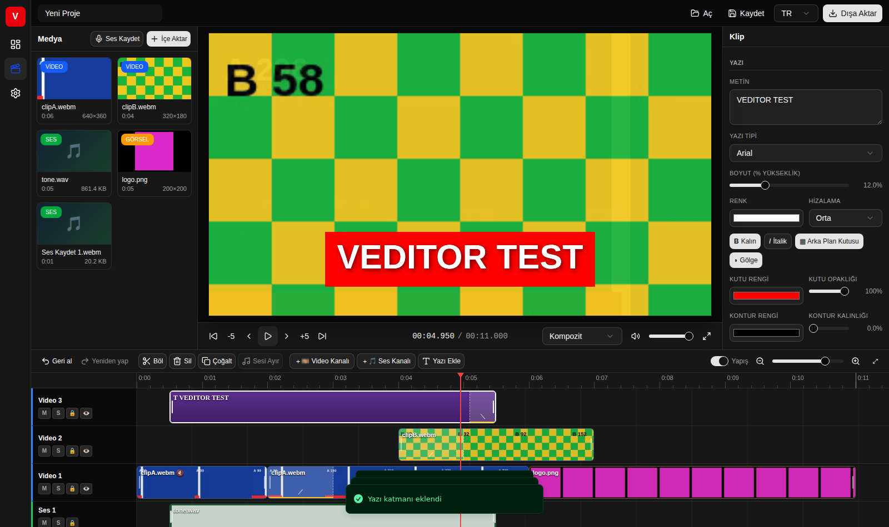

# Veditor – Çok Kanallı Tarayıcı Video Editörü (React + shadcn/ui)

[](https://github.com/tansuozcelebi/Veditor/actions/workflows/ci.yml)

Veditor, tamamen tarayıcıda çalışan çok kanallı bir video editörüdür. Birden fazla video/ses kanalını aynı anda
oynatır, kliplerinizi keser/böler/taşır, ses ekleyip mikserler, seslendirme kaydeder, geçiş efektleri ve yazı
katmanları ekler ve sonucu tek bir video dosyası olarak dışa aktarır. Medya hiçbir zaman makinenizden çıkmaz.

Uygulama **React 19 + TypeScript + Vite + Tailwind CSS v4 + shadcn/ui (new-york)** ile yazılmıştır ve
`src/features/video-editor` altında **kendi kendine yeten bir özellik modülü** olarak paketlenmiştir. Bu sayede
başka bir shadcn tabanlı uygulamaya (örneğin **KREAWMS-FRONTEND-SHADCN**) bir menü sayfası / rota olarak
kopyalanıp takılabilir. Ayrıntılar için [Başka bir uygulamaya entegrasyon](#başka-bir-uygulamaya-entegrasyon-wms) bölümüne bakın.

> English summary: Veditor is a browser-only multi-track video editor built with React 19, TypeScript, Vite,
> Tailwind v4 and shadcn/ui. It composites several video layers (full-frame or picture-in-picture), mixes multiple
> audio tracks with volume/fades, records voice-overs, adds text layers and clip transitions, and exports via
> `MediaRecorder` (WebM VP9/VP8 + Opus, or MP4 where supported). The editor ships as a self-contained feature
> module (`src/features/video-editor`) that can be mounted as a route inside any shadcn-based host app.



## Özellikler

| Alan | Özellik |
| --- | --- |
| **Çok kanallı oynatıcı** | Sınırsız video ve ses kanalı. Video kanalları katman olarak (üstteki kanal öne) Canvas üzerinde birleştirilir; **Kanal Izgarası** modu tüm kanalları yan yana gösterir. Web Audio API ile tüm kanallar aynı anda miks edilir. |
| **Medya** | Video, ses ve görsel içe aktarma (sürükle-bırak veya dosya seçici). Küçük resimler, dalga formu, süre/çözünürlük analizi. |
| **Düzenleme** | Sürükleyerek taşıma (kanallar arası dahil), uçlardan kırpma, oynatma kafasında bölme (**S**), çoğaltma, silme, yapışma (snap), çakışma engelleme, geri al / yeniden yap (100 adım), sağ tık menüsü. |
| **Ses ekleme** | Ses dosyası ekleme, **mikrofonla seslendirme kaydı** (zaman çizelgesi oynatılırken), video klibin **sesini ayrı kanala kopyalama**, klip ve kanal bazında ses seviyesi, sessiz, solo, fade-in / fade-out. |
| **Görüntü** | Klip başına opaklık, sığdırma modu (sığdır/kapla/esnet), ölçek ve konum; hazır **PiP** (resim içinde resim) ve yarım ekran yerleşimleri. |
| **Geçiş efektleri** | Klip başına giriş/çıkış geçişi: çapraz erime, sola/sağa/yukarı/aşağı kaydırma, yakınlaşma, sola/sağa silme, bulanıklık. Bitişik önceki klip varsa iki klip harmanlanır (önceki klip uzatılır, sesler çapraz geçer); yoksa klip alttaki katmandan belirir. |
| **Yazı katmanı** | Video kanallarına yazı klipleri (**T** tuşu veya "Yazı Ekle"): çok satırlı metin, yazı tipi, boyut, renk, kalın/italik, hizalama, arka plan kutusu, kontur, gölge, satır aralığı; konum/ölçek/opaklık ve geçişler tüm kliplerde olduğu gibi çalışır. |
| **Dışa aktarma** | WebM (VP9/VP8 + Opus) ya da tarayıcı destekliyorsa MP4 (H.264 + AAC); yalnızca ses (Opus / AAC). Çözünürlük (1080p, 720p, 4K, dikey, kare, özel), kare hızı, bit hızı, ilerleme çubuğu, önizleme ve indirme. WebM çıktısına süre bilgisi otomatik eklenir. |
| **Proje** | Proje ayarları (çözünürlük, FPS, arka plan), proje dosyasını JSON olarak kaydetme / açma (medya dosyaları yeniden eşleştirilir), TR / EN arayüz. |

## Çalıştırma

```bash
npm install
npm run dev          # Vite geliştirme sunucusu: http://localhost:8080 (tarayıcıyı açar)
npm run build        # tip denetimi + üretim derlemesi → dist/
npm run preview      # dist/ klasörünü http://localhost:8080 üzerinden sunar
```

Geliştirme kabuğu (`src/app/App.tsx`) bir yan menü ile üç rota içerir; editör `/video-editor` altındadır.
**Chrome / Edge** (Chromium tabanlı tarayıcılar) önerilir; Firefox'ta dışa aktarma WebM ile sınırlıdır, Safari'de
MediaRecorder desteği kısıtlıdır. Node 20+ gerekir.

## Kullanım

1. **İçe Aktar** ile video / ses / görsel dosyalarını ekleyin (ya da sol panele veya zaman çizelgesine sürükleyin).
2. Medya kartındaki **＋** ile oynatma kafasına ekleyin, çift tıklayın ya da doğrudan istediğiniz kanala sürükleyin.
   Ses dosyaları otomatik olarak ses kanalına gider; video bir ses kanalına bırakılırsa yalnızca sesi kullanılır.
3. Klipleri sürükleyin, uçlarından kırpın, **S** ile bölün. Sağ tık menüsünde tüm işlemler vardır.
4. Bir klibi seçince sağdaki **Özellikler** panelinde ses, fade, opaklık, ölçek, konum, geçişler ve yazı ayarları görünür.
5. **Ses Kaydet** ile mikrofondan seslendirme kaydedin; kayıt oynatma kafasından başlar ve durdurunca ses kanalına eklenir.
6. **Dışa Aktar** ile biçim, çözünürlük, FPS ve kaliteyi seçip başlatın. Dışa aktarma gerçek zamanlı çalışır
   (5 dakikalık proje ≈ 5 dakika); sekmeyi ön planda tutun.

### Kısayollar

| Tuş | İşlev |
| --- | --- |
| `Space` | Oynat / Duraklat |
| `S` | Seçili klibi (yoksa oynatma kafası altındaki klipleri) böl |
| `T` | Oynatma kafasına yazı katmanı ekle |
| `Delete` / `Backspace` | Seçili klipleri sil |
| `Ctrl+Z` / `Ctrl+Y` | Geri al / Yeniden yap |
| `Ctrl+D` | Çoğalt |
| `Ctrl+A` | Tüm klipleri seç |
| `M` | Seçili klibi sessize al / aç |
| `← / →` (+`Shift`) | Kare kare (1 sn) ilerle |
| `J` / `K` / `L` | 5 sn geri / duraklat / 5 sn ileri |
| `Home` / `End` | Başa / sona git |
| `+` / `-`, `Ctrl+Tekerlek` | Yakınlaştır / uzaklaştır |
| `Ctrl+S` / `Ctrl+E` | Projeyi kaydet / Dışa aktar |

## Mimari

```
index.html                         Vite giriş sayfası (#root)
src/main.tsx                       React kökü
src/index.css                      Tailwind v4 + shadcn tema değişkenleri (oklch), dark variant
src/app/App.tsx                    Geliştirme kabuğu: yan menü + react-router rotaları (host uygulamayı taklit eder)
src/lib/utils.ts                   shadcn `cn()` yardımcısı
src/components/ui/                 shadcn/ui bileşenleri (new-york): button, input, textarea, label, separator, badge,
                                   switch, slider, select, native-select, dialog, context-menu, tooltip, scroll-area, sonner
src/features/video-editor/         ▶ ÖZELLİK MODÜLÜ (host uygulamaya kopyalanacak klasör)
  index.ts                         Genel API: <VideoEditor />, Store, Player, Exporter, i18n, tipler
  editor.css                       Zaman çizelgesi / klip / medya kartı stilleri (.veditor altında, shadcn değişkenlerini kullanır)
  components/VideoEditor.tsx       Ana bileşen: düzen, düzenleme komutları, kısayollar, diyaloglar
  components/TopBar.tsx            Proje adı, aç/kaydet, dil, dışa aktar
  components/MediaLibrary.tsx      Medya kitaplığı (içe aktarma, sürükle-bırak, kayıt)
  components/Preview.tsx           Canvas önizleme, taşıma kontrolleri, görünüm modu, monitör sesi
  components/TimelinePanel.tsx     Araç çubuğu + zaman çizelgesi (Radix ContextMenu ile sağ tık menüsü)
  components/Inspector.tsx         Klip / kanal / proje özellik paneli
  components/ExportDialog.tsx      Dışa aktarma diyaloğu (ilerleme, önizleme, indirme)
  components/RecordDialog.tsx      Mikrofon kayıt diyaloğu
  components/OpenProjectDialog.tsx Proje açarken medya eşleştirme
  hooks/useEditor.tsx              EditorProvider (Store/Player/Exporter ömrü), useEditor, useStoreEvents, usePlayerTime, useI18n
  hooks/useImportFiles.ts          Bildirimli dosya içe aktarma
  engine/types.ts                  Track, Clip, Project, MediaItem, Export* tipleri
  engine/state.ts                  Proje modeli, seçim, geri al / yeniden yap, yerleşim/çakışma, bölme, biçimlendirme
  engine/media.ts                  İçe aktarma, metadata, küçük resimler, dalga formu
  engine/player.ts                 Oynatma motoru: AudioContext saati, Web Audio miks grafı, Canvas kompozit, geçişler, yazı
  engine/timeline.ts               Zaman çizelgesi DOM motoru (cetvel, sürükleme/kırpma/yapışma) – React ref ile sarılır
  engine/exporter.ts               MediaRecorder tabanlı dışa aktarma
  engine/webm-fix.ts               WebM çıktısına Duration alanı ekleyen EBML yamalayıcı
  engine/i18n.ts                   TR / EN çeviriler
test/                              Playwright uçtan uca duman testi (üretim derlemesine karşı) ve fikstür üretici
```

**Katmanlar:** `engine/` React'ten bağımsız, tip güvenli sınıflardan oluşur (Store olay yayar, Player/Exporter
bu Store'u kullanır). `hooks/useEditor.tsx` bu nesneleri bir React Context'te yaşatır; bileşenler
`useStoreEvents([...])` ile yalnızca ilgili olaylarda yeniden çizilir (`useSyncExternalStore`). Zaman çizelgesi
performans nedeniyle imperatif kalır ve `TimelinePanel` içinde bir ref üzerinden yönetilir.

**Oynatma senkronu:** Ana saat `AudioContext.currentTime`'dır. Her karede aktif kliplerin öğeleri kaynak
konumuna (`offset + (t - start)`) hizalanır; 200 ms'den fazla sapan öğe yeniden konumlanır, yaklaşan klipler
1,5 sn önceden hazırlanır. Her klip kendi `GainNode`'una, her kanal kendi kanal kazancına bağlıdır; miks hem
hoparlöre hem de dışa aktarma için `MediaStreamDestination`'a gider.

## Başka bir uygulamaya entegrasyon (WMS)

Editör, KREAWMS-FRONTEND-SHADCN gibi bir shadcn/ui uygulamasına **bir menü öğesi + rota** olarak eklenmek üzere
tasarlandı. Varsayılan host varsayımları: Vite + React + TypeScript, Tailwind CSS v4, shadcn/ui (new-york, CSS
değişkenleri, `@/` takma adı), lucide-react ikonları, react-router. Adımlar:

1. **Klasörü kopyalayın:** `src/features/video-editor/` → host uygulamada aynı yola.
2. **shadcn bileşenlerini sağlayın:** Host'ta yoksa `npx shadcn@latest add button input textarea label separator
   badge switch slider select dialog context-menu tooltip scroll-area sonner` çalıştırın. `native-select`
   shadcn kayıt defterinde yeni bir bileşendir; yoksa `src/components/ui/native-select.tsx` dosyasını kopyalayın.
   Modül yalnızca `@/components/ui/*` ve `@/lib/utils` yollarına bağımlıdır.
3. **Bağımlılıklar:** `react-router-dom` hariç `package.json` içindeki `dependencies` (radix-ui, lucide-react,
   sonner, clsx, tailwind-merge, class-variance-authority) host'ta bulunmalıdır. Host shadcn'in eski
   `@radix-ui/react-*` paketlerini kullanıyorsa `src/components/ui` içindeki `from 'radix-ui'` içe aktarmaları
   host'un kendi bileşenleriyle değiştirilebilir; editör bileşenleri Radix'e doğrudan bağımlı değildir.
4. **Rota ve menü:**

   ```tsx
   import { VideoEditor } from '@/features/video-editor';

   // Rota (react-router örneği)
   <Route path="/video-editor" element={<VideoEditor embedded />} />

   // Menü öğesi (sidebar)
   { title: 'Video Editörü', url: '/video-editor', icon: Clapperboard }
   ```

   Editör, kendisini saran kapsayıcının yüksekliğini doldurur; sayfa kapsayıcısına `h-full min-h-0`
   (ya da `h-[calc(100vh-…)]`) vermeniz yeterlidir. `embedded` özelliği üst çubuktaki markayı gizler.
5. **Tema:** Editör koyu temada çalışacak şekilde kök öğesine `dark` sınıfını ekler ve yalnızca shadcn CSS
   değişkenlerini (`--background`, `--primary`, `--sidebar` …) kullanır; host'un renk paleti otomatik uygulanır.
   Host'ta `@custom-variant dark (&:is(.dark *))` (Tailwind v4 shadcn varsayılanı) tanımlı olmalıdır.
6. **Geri çağrılar:** `onExport(result, fileName)` ile dışa aktarılan dosyayı WMS'e yükleyebilir,
   `onReady(ctx)` ile `store`/`player`/`exporter` nesnelerine erişebilirsiniz.

Host uygulamanın `package.json` ve `components.json` dosyaları paylaşılırsa bileşen sürümleri ve takma adlar
birebir hizalanabilir.

## Test ve CI

```bash
npm install
npx playwright install chromium
npm run lint          # ESLint (typescript-eslint, react-hooks, react-refresh)
npm run build         # tsc + vite build
npm test              # Playwright duman testi (dist/ üzerinden)
```

Aynı adımlar GitHub Actions üzerinde her push ve pull request için otomatik çalışır (`.github/workflows/ci.yml`);
ekran görüntüsü ve dışa aktarılan örnek video iş akışı çıktısı olarak yüklenir.

Test, üretim derlemesini yerel bir sunucudan (SPA yedeği ile) başsız Chromium'da açar; deterministik fikstürler
(iki VP8 video, WAV ton, PNG) üretir, içe aktarma → yerleştirme → bölme/geri alma → fare ile sürükleme/kırpma →
oynatma/kompozit/ızgara → sesi ayırma → sahte mikrofonla seslendirme kaydı → geçişler → yazı katmanı → sağ tık
menüsü → proje kaydet/aç → dışa aktarma akışını doğrular ve çıktıyı Playwright ile gelen ffmpeg ile kontrol eder.
Çıktılar `test/output/` altına yazılır.

### Otomatik birleştirme (auto-merge)

Özel depolarda ücretsiz planda dal koruma kuralı olmadığı için GitHub'ın kendi auto-merge'i CI'yı bekleyemez.
Bu yüzden iş akışında CI'ya bağlı bir `automerge` işi vardır: **`automerge` etiketi** taşıyan ve taslak olmayan bir
pull request, test işi yeşil olur olmaz merge commit ile `main` dalına birleştirilir. Etiketi kaldırmak veya PR'ı
taslağa çevirmek otomatik birleştirmeyi durdurur.

## Sınırlamalar

- Dışa aktarma gerçek zamanlıdır (MediaRecorder); arka plandaki sekmelerde kare üretimi durur.
- MP4 çıktısı yalnızca tarayıcı `MediaRecorder` ile `video/mp4` destekliyorsa listelenir (Chrome 126+ birçok platformda destekler).
- Proje dosyası medya içermez; açarken dosyalar ada göre yeniden eşleştirilir.
- Hız değiştirme (yavaş/hızlı çekim) bu sürümde yoktur.

## Lisans

MIT
